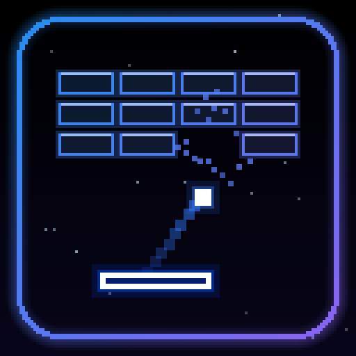
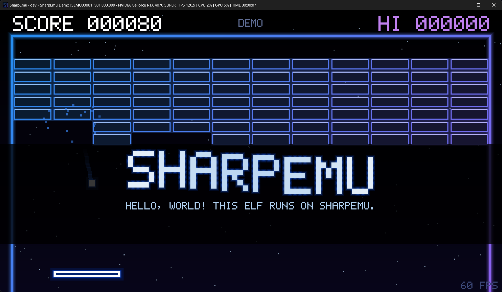

# SharpEmu Demo

<p align="center">
  
</p>

<p align="center">
  A small Breakout game for the PS5, built as a single self-contained ELF.
</p>

It needs no data files. The font, graphics and game logic are all in the source. The game draws on the CPU into a 480x270 buffer and scales it 4x into a 1920x1080 tiled VideoOut buffer.

<p align="center">
  
</p>

## Controls

When nobody is playing, the game plays itself.

| Action | Controller | SharpEmu keyboard |
| --- | --- | --- |
| Start / launch the ball | Cross | Z or Enter |
| Move the paddle | Left stick or D-pad | Arrow keys or A/D |
| Back to the demo screen | Options | Tab |

## Layout

| Path | Contents |
| --- | --- |
| `src/game.c`, `src/game.h` | Game logic and drawing, with no platform code |
| `src/main.c` | PS5 entry point, VideoOut, pad input and timing |
| `static/` | Metadata, icons and background, copied into `sce_sys/` |
| `build.py` | Builds the app folder |

## Building

The build needs Python 3, [ps5-payload-sdk](https://github.com/ps5-payload-dev/sdk) (v0.43) and LLVM 18 or newer. It does not use the SDK's libc or startup files, so the ELF only imports `libkernel`, `libSceVideoOut`, `libSceSystemService`, `libSceUserService` and `libScePad`.

The build marks the ELF header with the PS5 OSABI (9) and ABI version (2), so SharpEmu detects it as PS5. The output remains a plain ELF, not a SELF container.

Imports use the NIDs from SharpEmu's export catalog. The build generates temporary link-only stubs with the original library names; these are not included in the app folder. Source code still calls the readable function names, but `eboot.bin` imports NIDs, so no plain-symbol support is needed in the emulator.

```sh
export PS5_PAYLOAD_SDK=/opt/ps5-payload-sdk
python3 build.py /path/to/sharpemu-demo
```

The output folder must be outside the repository. SharpEmu opens it like a game dump:

```text
sharpemu-demo/
  eboot.bin
  sce_sys/
    param.json
    icon0.png
    pic0.png
```

## CI

Every push and pull request builds the app folder and uploads it as the `sharpemu-demo` artifact. Every push to the default branch also publishes a release tagged with the short commit hash, with `sharpemu-demo.zip` attached. SharpEmu downloads that zip during its build.

## License

Code: GPL-2.0-or-later. See [LICENSE](LICENSE.txt).
